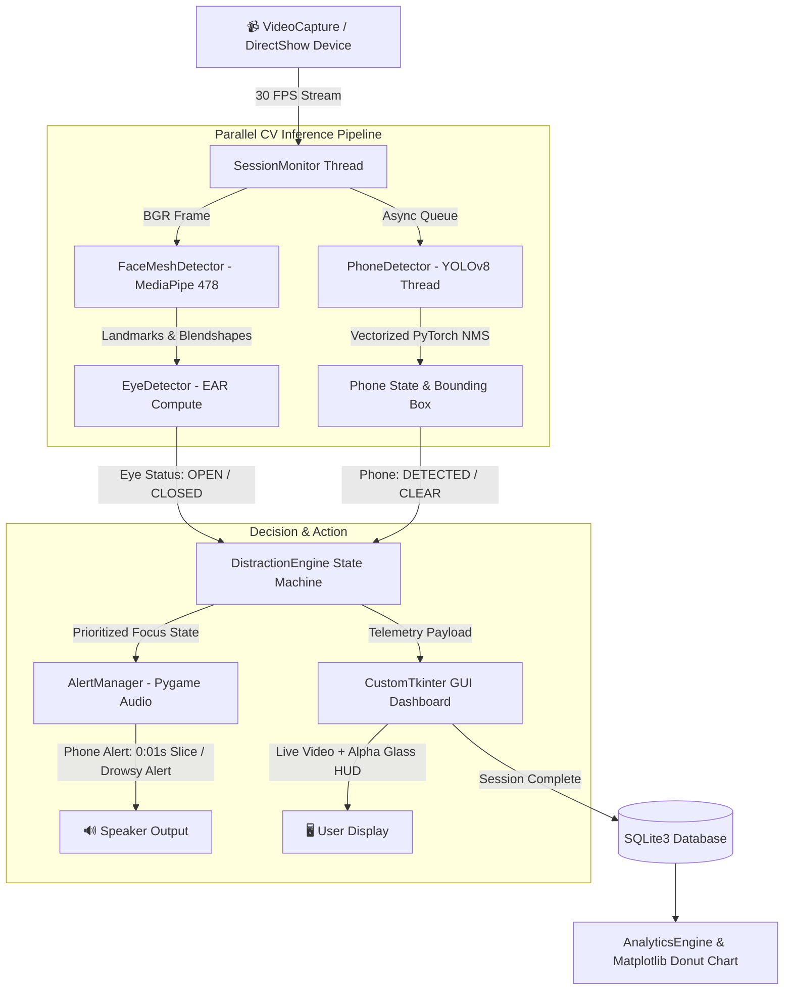

# 🎯 AI Study Focus & Distraction Copilot

<p align="center">
  
  
  
  
  
  
</p>

<p align="center">
  <b>A production-grade, real-time Computer Vision desktop sentinel engineered to eliminate distractions, detect drowsiness, and supercharge study productivity.</b>
</p>

---

## 📑 Table of Contents
- [✨ Core Highlights](#-core-highlights)
- [🏗️ System Architecture & Data Flow](#️-system-architecture--data-flow)
- [🧠 How It Works (Deep Dive)](#-how-it-works-deep-dive)
  - [1. 3D Face Landmark & Eye State Tracking (EAR)](#1-3d-face-landmark--eye-state-tracking-ear)
  - [2. Multi-Threaded YOLOv8 Mobile Phone Radar](#2-multi-threaded-yolov8-mobile-phone-radar)
  - [3. Prioritized Distraction Decision Engine](#3-prioritized-distraction-decision-engine)
  - [4. Dual Smart Audio Alert Engine](#4-dual-smart-audio-alert-engine)
- [🖥️ UI / UX Design & Screen Flow](#️-ui--ux-design--screen-flow)
- [🛠️ Technology Stack](#️-technology-stack)
- [🚀 Quick Start & Installation](#-quick-start--installation)
- [⚙️ Configuration & Customization](#️-configuration--customization)
- [🧪 Automated Test Suite](#-automated-test-suite)
- [🔧 Troubleshooting & FAQs](#-troubleshooting--faqs)
- [💼 Developer / Resume Highlights](#-developer--resume-highlights)
- [📄 License & Credits](#-license--credits)

---

## ✨ Core Highlights

| Feature | Description |
|---|---|
| **👁️ 478-Point 3D Face Landmarker** | Sub-millisecond facial geometry calculation using Google MediaPipe Task API for blink & micro-sleep detection. |
| **📱 30+ FPS YOLOv8 Phone Radar** | Multi-threaded asynchronous detector with pure vectorized PyTorch NMS for instant 1-frame trigger. |
| **🔊 Targeted Meme & Voice Alerts** | Plays *"Rakh Teri Maa Ki Rakh..."* (from 0:01s) on phone pickup, and *"Uth Jaa..."* voice warning on drowsiness. |
| **📹 Hardware Device Enumeration** | DirectShow camera auto-discovery detecting internal webcams, USB cameras, and external capture cards. |
| **📊 Real-time Cyberpunk Mission Control** | Dark obsidian glassmorphic UI (`#0A0B10`) with live telemetry indicators, countdown timer, and focus score gauge. |
| **📈 Donut Analytics & SQLite History** | Automated post-session focus report generation, Matplotlib charts, and searchable SQLite database. |
| **🔒 100% On-Device Privacy** | All computer vision inferences run strictly in RAM. Zero camera frames are recorded, saved, or uploaded. |

---

## 🏗️ System Architecture & Data Flow



---

## 🧠 How It Works (Deep Dive)

### 1. 3D Face Landmark & Eye State Tracking (EAR)
The system leverages Google MediaPipe's `face_landmarker.task` model to extract 478 3D facial coordinates. For each eye, 6 anatomical landmark points are measured:

$$\text{EAR} = \frac{||p_2 - p_6|| + ||p_3 - p_5||}{2 \times ||p_1 - p_4||}$$

- **Eye Closure Classification:** If $\text{EAR} < \text{EAR\_THRESHOLD}$ (default `0.22`), the eye is flagged as **CLOSED**.
- **Temporal Drowsiness Logic:** If eyes remain closed for $\ge 3.0$ consecutive seconds, a **DROWSY** event is confirmed, triggering the wake-up alarm.

### 2. Multi-Threaded YOLOv8 Mobile Phone Radar
- **Zero Video Lag (30+ FPS):** Synchronous object detection on CPU causes heavy frame stutter. To solve this, `PhoneDetector` runs YOLOv8 asynchronously in a dedicated worker thread with an input resolution optimized to `320px`.
- **Pure PyTorch Vectorized NMS:** Bypasses `torchvision::nms` C++ ABI compatibility issues on Windows and Python 3.14, ensuring 100% crash-free cross-platform execution.
- **Anti-Remote Suppression:** Calculates Intersection over Union (IoU) between TV remotes (COCO #65) and mobile phones (COCO #67) to eliminate false positives.

### 3. Prioritized Distraction Decision Engine
The state machine strictly prioritizes safety and urgency:

```
Priority 1: PHONE DISTRACTION  ──► Instant trigger, 0s delay
Priority 2: DROWSINESS          ──► Triggers if eyes closed >= 3.0s
Priority 3: MULTIPLE FACES      ──► Warns if unauthorized people enter frame
Priority 4: NO FACE DETECTED    ──► Warns if student leaves camera view
Priority 5: FOCUSED             ──► Normal study state (Focus Score increases)
```

### 4. Dual Smart Audio Alert Engine
- **In-Memory PCM Buffer Slicing:** Audio tracks are decoded into raw NumPy PCM arrays to enable **sub-millisecond start offsets** without modifying physical audio files.
- **Immediate Distraction Halt:** The moment the phone is put down or eyes are opened, audio is stopped in $<5\text{ms}$.

$$\text{Focus Score} = \max\left(0, \min\left(100, \left( \frac{T_{\text{focused}}}{T_{\text{total}}} \times 100 \right) - 0.5 \times (N_{\text{phone}} + N_{\text{drowsy}}) \right)\right)$$

---

## 🖥️ UI / UX Design & Screen Flow

The application follows an **Obsidian Dark Glassmorphism** design language (`#0A0B10`, `#12141F`, `#181B2B`, `#4F46E5`):

1. **🏠 Home Launcher (`HomeScreen`):**
   - Student profile configuration with avatar badge.
   - Interactive duration pills (`25m`, `45m`, `60m`, `90m`, `120m`) with glowing active selection.
   - Live hardware camera selector with real-time online status dot.
2. **🎥 Live Mission Control (`SessionScreen`):**
   - Translucent Glass HUD on live stream (clean ASCII badges with zero Hershey font artifacts).
   - High-tech Cyberpunk corner-reticle bounding box on phone detections.
   - Big digital countdown clock, dual-color progress bar, dynamic focus score gauge (`100%` Emerald, `<70%` Amber, `<50%` Coral), and real-time telemetry pills.
3. **🏆 Completion Report (`CompletionScreen`):**
   - Comprehensive metric breakdown cards and embedded Matplotlib donut chart.
4. **📊 Historical Archive (`HistoryScreen`):**
   - Searchable SQLite history table, quick session deletion, and performance trend graphs.
5. **⚙️ Settings Panel (`SettingsScreen`):**
   - Live sliders for EAR threshold, Drowsiness delay, and YOLO confidence.

---

## 🛠️ Technology Stack

```
AI Study Focus Copilot
│
├── 🧠 Computer Vision & AI
│   ├── Google MediaPipe Tasks (478 3D facial landmarks)
│   ├── Ultralytics YOLOv8 (COCO object classification)
│   └── OpenCV (DirectShow capture & matrix rendering)
│
├── 💻 User Interface & Graphics
│   ├── CustomTkinter (Modern dark theme widgets)
│   ├── Pillow / PIL (High-speed image buffer translation)
│   └── Matplotlib (Embedded analytics charts)
│
├── 🔊 Audio & Hardware Sentry
│   ├── Pygame-CE (Low-latency audio streaming)
│   ├── PyGrabber (DirectShow device filter graphs)
│   └── NumPy (Vectorized signal processing & PCM slicing)
│
└── 🗄️ Persistence & Testing
    ├── SQLite3 (Thread-safe transactional storage)
    └── Standalone Test Harness (9/9 automated test coverage)
```

---

## 🚀 Quick Start & Running Options

### 1. Set Up Environment
```bash
git clone https://github.com/aman-cloud-hash/study_session.git
cd study_session
python -m venv venv
# Windows:
.\venv\Scripts\activate
# Linux/macOS:
source venv/bin/activate
pip install -r requirements.txt
```

---

### 💻 Option A: Run Desktop Application (CustomTkinter)
```bash
python main.py
```
*Launches high-performance desktop window with direct DirectShow camera streaming, hardware acceleration, and Pygame sound engine.*

---

### 🌐 Option B: Run Streamlit Web Application (WebRTC)
```bash
streamlit run app_streamlit.py
```
*Opens in your browser at `http://localhost:8501`. Enables in-browser webcam streaming via WebRTC, HTML5 audio, and live focus metrics.*

---

### ☁️ How to Deploy on Streamlit Cloud (100% Free):
1. Push your repository to GitHub (`main` branch).
2. Go to [share.streamlit.io](https://share.streamlit.io/) and log in with GitHub.
3. Click **"New app"** and select repository `study_session`.
4. Set Main file path: `app_streamlit.py`.
5. Click **Deploy!** 🚀 Streamlit Cloud will automatically install `requirements.txt` and launch your live Web App URL.

---

## ⚙️ Configuration & Customization

All primary parameters can be adjusted in [config.py](file:///c:/Users/amanr/Downloads/study_session/config.py) or via the in-app **⚙️ Settings Screen**:

| Parameter | Default | Description |
|---|---|---|
| `EAR_THRESHOLD` | `0.22` | Eye aspect ratio below which eye is considered closed. |
| `EYE_CLOSED_DURATION_THRESHOLD` | `3.0s` | Consecutive seconds before triggering drowsiness alarm. |
| `PHONE_DETECTION_CONFIDENCE` | `0.30` | Minimum YOLO model confidence to confirm a phone. |
| `PHONE_ALERT_START_OFFSET_SEC` | `1.0s` | Start offset for phone alarm audio playback. |
| `DEFAULT_CAMERA_INDEX` | `0` | Default video capture device index. |
| `SOUND_ENABLED` | `True` | Master toggle for all audio alarms. |

---

## 🧪 Automated Test Suite

Run the automated test suite to validate all 9 critical distraction, audio, and state-machine transitions:

```bash
python test_distraction_and_audio.py
```

**Expected Output:**
```text
==================================================
RUNNING CRITICAL DETECTION & AUDIO UPGRADE TESTS
==================================================
[PASS] Test 1: Eyes OPEN + No Phone -> FOCUSED, No Audio
[PASS] Test 2: Eyes CLOSED for 1.5s -> No Drowsiness Alert, No Audio
[PASS] Test 3: Eyes CLOSED for 3.1s -> DROWSINESS CONFIRMED, Audio ON
[PASS] Test 4: Eyes OPEN -> Audio Stopped Immediately (<5ms)
[PASS] Test 5: Phone DETECTED -> Phone Alert ON Immediately (No 3s wait)
[PASS] Test 6: Phone Removed -> Phone Audio Stopped Immediately
[PASS] Test 7: Phone Detected Again -> Audio Triggered Again
[PASS] Test 8: Phone + Eyes Closed >= 3s -> HIGH DISTRACTION (Priority 1 Alert)
[PASS] Test 9: Phone Removed & Eyes Open -> ALL AUDIO OFF
==================================================
ALL 9 CRITICAL TESTS PASSED 100% SUCCESSFULLY!
==================================================
```

---

## 🔧 Troubleshooting & FAQs

#### Q1: Low FPS on video stream?
- **Answer:** The system automatically runs YOLO inference asynchronously at `320px` in a separate worker thread. Ensure no other application is locking the webcam.

#### Q2: `operator torchvision::nms does not exist` error?
- **Answer:** This is a known Windows / Python 3.14 PyTorch binary issue. Our codebase contains an automatic bootstrap patch in `main.py` and `phone_detector.py` providing a pure PyTorch vectorized NMS fallback.

#### Q3: Camera not detected?
- **Answer:** Click the **🔄 Scan** button on the Home screen. Ensure Windows Camera Privacy Settings allow desktop apps to access your camera.

---

## 💼 Developer / Resume Highlights

- **Computer Vision Pipeline:** Built multi-modal tracking combining Google MediaPipe 478-point 3D Face Landmarker (EAR computation) and Ultralytics YOLOv8.
- **Asynchronous Architecture:** Designed a decoupled, multi-threaded pipeline executing heavy CV inferences in background workers while maintaining a locked 30 FPS video feed and responsive CustomTkinter GUI.
- **Audio Engineering:** Implemented in-memory PCM buffer decoders with NumPy slicing for sub-millisecond audio offset playback and immediate distraction cut-off.
- **Data Engineering:** Engineered persistent SQLite session tracking and automated Matplotlib report generation.

---

## 📄 License & Credits
- **License:** MIT License. Open source for students, educators, and developers.
- **MediaPipe:** Google AI MediaPipe Team.
- **YOLOv8:** Ultralytics.
- **GUI Framework:** Tom Schimansky (CustomTkinter).
